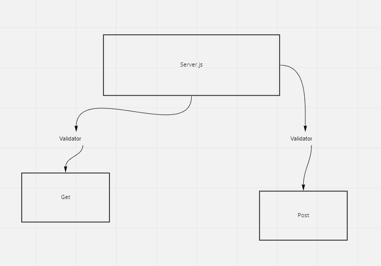

# express-server-deployment

HTTP express server on Heroku

DEV

## Installation

to install run `git clone git@github.com:ryanyinlee/express-server-deployment.git`

`cd` into express-server-deployment

run `npm install`

## Usage

`npm start` to run server

`npm test` to test server

## Routes

* GET '/message'

* POST '/message?text=YOURTEXT&author=YOURNAME'

## Current Deploys/GitHub Repository

GitHubRepository

https://github.com/ryanyinlee/express-server-deployment

Dev Branch:

https://ryanlee-server-deploy-dev.herokuapp.com/

Main/Production:

https://ryanlee-server-deploy-prod.herokuapp.com/

## 1/10/21 Pull Request

https://github.com/ryanyinlee/express-server-deployment/pull/3

## 1/11/21 UML

To be improved. I know they're important, just not great at making them yet.

